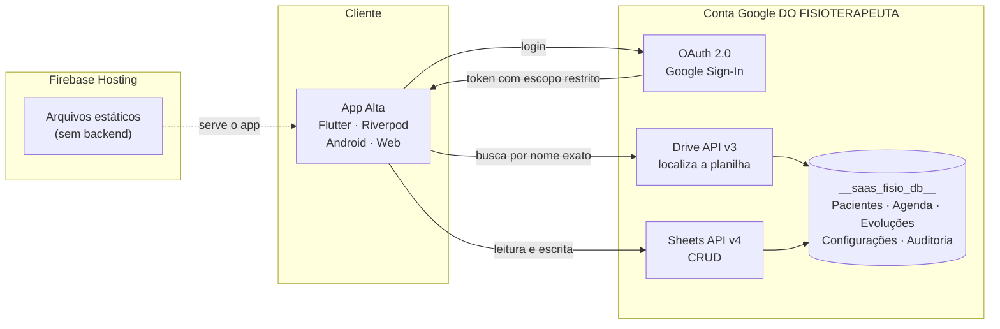

<div align="center">

# Alta

**Fisioterapia domiciliar: agenda, prontuário e evolução clínica no bolso do profissional — sem servidor central e sem os dados saírem da conta do fisioterapeuta.**

[](https://github.com/lacerdaRodrigo/alta/actions/workflows/deploy-prod.yml)
[](https://github.com/lacerdaRodrigo/alta/actions/workflows/deploy-preview.yml)
[](https://flutter.dev)
[](documentacao/testes/)
[](LICENSE)

[**Acessar o aplicativo**](https://app-fisio-care-2.web.app) · [Documentação](documentacao/) · [Modelo de dados](documentacao/MODELO_DADOS.md) · [Segurança e LGPD](documentacao/SEGURANCA_E_DADOS.md)

</div>

---

## O problema

Fisioterapeuta domiciliar atende na casa do paciente, entre um deslocamento e
outro. A rotina real é caderno, WhatsApp e planilha solta: a agenda mora num
lugar, a evolução clínica em outro, o valor da sessão na cabeça. E qualquer
prontuário em SaaS tradicional significa entregar dado de saúde de terceiro para
uma empresa — responsabilidade que a LGPD coloca no colo do profissional.

## A solução

O **Alta** — nome do desfecho de todo tratamento, "dar alta" — junta agenda,
prontuário e financeiro num app só, e resolve a questão dos dados invertendo o
modelo: **BYODB (Bring Your Own Database)**. O fisioterapeuta conecta a própria
conta Google, e o app cria e usa uma planilha no Drive *dele*. Não existe banco
central, não existe prontuário sob custódia de terceiro, não existe conta a
pagar por armazenamento.

### O que o app faz

| | |
|---|---|
| **Pacientes** | Cadastro com anamnese clínica completa (queixa, histórico, comorbidades, medicamentos, alergias, cirurgias, hábitos), validação de CPF e cálculo de idade |
| **Agenda** | Visão calendário e lista, agendamento com valor da sessão, desfechos (Realizado / Cancelado / Faltou), reagendamento |
| **Evolução clínica** | Registro por sessão com protocolo aplicado, ditado por voz, timeline por paciente e **janela de edição de 24h** — depois disso o registro fecha, mas continua legível |
| **Financeiro** | Resumo mensal por situação de sessão |
| **Rotas** | Abertura do endereço do paciente no Google Maps / Waze |

## Telas

> 🚧 **Pendente:** capturas de tela ainda não adicionadas. Os PNGs entram em
> `docs/imagens/` e substituem os links abaixo.

<!--
| Login | Início | Pacientes | Evolução |
|---|---|---|---|
|  |  |  |  |
-->

## Arquitetura

Não há backend próprio. O app fala direto com as APIs do Google usando o token
OAuth do próprio usuário — o Firebase Hosting só entrega arquivos estáticos.



**Consequências do desenho:**

- Nenhum dado clínico passa por infraestrutura do mantenedor — LGPD por arquitetura
- Custo de operação praticamente zero (sem banco, sem servidor)
- O profissional pode abrir a planilha e ver os próprios dados a qualquer momento
- Em troca: sem consulta relacional, sem transação; o versionamento de esquema
  (`lib/servicos/versao_esquema.dart`) é quem mantém a compatibilidade

## Stack

| Tecnologia | Versão | Papel |
|---|---|---|
| Flutter + Dart | SDK `^3.12.0` (CI em 3.44.1) | App Android + Web, Material 3, null-safety |
| Riverpod | 3.x | Estado e injeção de dependência |
| Google Sheets API | v4 | Banco de dados (BYODB) |
| Google Drive API | v3 | Localizar a planilha do usuário |
| Google Sign-In | 7.2.0 (`google_sign_in_web` 1.1.3) | Autenticação OAuth 2.0 |
| Table Calendar | 3.1.3 | Visão calendário da agenda |
| Speech to Text | — | Ditado dos registros clínicos |
| Firebase Hosting | — | Entrega dos arquivos web |

Código, pastas e nomenclatura em **português (PT-BR)** — decisão deliberada, o
domínio é clínico e brasileiro.

```
lib/
├── telas/          # 14 telas (login, início, pacientes, sessões, evolução, financeiro…)
├── componentes/    # design system e widgets reutilizáveis
├── provedores/     # estado com Riverpod
├── modelos/        # Paciente · Agendamento · Evolução (serialização de/para planilha)
├── servicos/       # Google Sign-In, Drive, Sheets, preferências, versão de esquema
└── utilitarios/    # validadores (CPF, telefone, data), máscaras, cálculo de idade
```

## Rodando localmente

**Pré-requisitos:** Flutter 3.44.1, uma conta Google e um projeto no Google Cloud
com as APIs Drive e Sheets habilitadas.

```bash
git clone git@github.com:lacerdaRodrigo/alta.git
cd alta
flutter pub get
cp .env.example .env      # preencha os client IDs OAuth
```

### Web

```bash
make dev-web              # http://localhost:5000
```

### Android (device físico — recomendado)

1. Ative **Depuração USB** no celular e conecte via cabo
2. `flutter devices` — confirme que o aparelho aparece
3. `make dev-android`

> ⚠️ **Pendência aberta desde a renomeação para "Alta".** O `applicationId` passou
> de `com.rodrigo.fisio_care` para `com.rodrigo.alta`, e o `google-services.json`
> atual ainda descreve o pacote antigo. Enquanto isso, todo build Android falha com:
>
> ```
> No matching client found for package name 'com.rodrigo.alta'
> ```
>
> Para destravar: no **Firebase Console** adicione um app Android com o pacote
> `com.rodrigo.alta` + o SHA-1 do keystore debug, baixe o `google-services.json`
> novo para `android/app/`, e no **Google Cloud Console → Credenciais** crie o
> cliente OAuth Android para o mesmo pacote (sem ele o build passa mas o login
> falha em execução). **Web e testes não são afetados.**
>
> SHA-1 debug local:
> ```bash
> keytool -list -v -keystore ~/.android/debug.keystore \
>   -alias androiddebugkey -storepass android -keypass android
> ```

## Testes

**368 testes automatizados** — 174 unitários + 194 de widget, cobrindo as 14
telas, os 3 modelos, os serviços de Drive/Sheets/repositório e os validadores.

```bash
flutter test                    # todos
flutter test test/unitarios/    # lógica pura
flutter test test/widgets/      # UI e interação
flutter test --coverage         # relatório de cobertura
make ci-local                   # exatamente o que a CI roda (lint + testes + build web)
```

Fora de cobertura por decisão: APIs reais do Google (consumiriam quota), login
real (exigiria device/navegador) e testes de carga. As chamadas HTTP ao Drive e
ao Sheets são exercitadas contra um servidor falso
(`test/unitarios/auxiliares/servidor_google_fake.dart`).

Detalhe teste a teste em [`documentacao/testes/`](documentacao/testes/).

## CI/CD

```
develop ──► lint + testes ──► preview channel (URL temporária)
   │
   ▼ merge quando aprovado
  main  ──► lint + testes ──► bump de versão ──► produção (app-fisio-care-2.web.app)
```

Se lint ou testes falharem, a publicação é cancelada — código quebrado não vai ao
ar. Não existe workflow de CI separado: a verificação está embutida nos dois
deploys.

```bash
make ci-local      # roda a mesma verificação da CI, localmente
make release-dev   # mescla a branch atual em develop → dispara o preview
make release-prod  # mescla develop em main → PUBLICA EM PRODUÇÃO (pede confirmação)
```

Guia completo, secrets e troubleshooting em [`documentacao/CI_CD.md`](documentacao/CI_CD.md).

## Ícone do aplicativo

O ícone é **desenhado em código** (`tool/gerar_icones.dart`) e renderizado pelo
engine do Flutter em cada tamanho final — Android (legado, redondo, adaptativo e
monocromático), web, iOS, macOS e Windows. Cada tamanho é renderizado direto, não
redimensionado a partir do 1024, o que mantém o traço limpo a 20px.

```bash
make icones     # não edite os PNGs à mão — a próxima execução os sobrescreve
```

## Segurança e LGPD

Os dados clínicos ficam na conta Google do profissional; o app usa OAuth 2.0 com
escopos restritos a Drive e Sheets. Nenhum dado de paciente transita por
infraestrutura do mantenedor.

- Política de segurança e como reportar falhas: [`SECURITY.md`](SECURITY.md)
- Modelo de dados, escopos e conformidade: [`documentacao/SEGURANCA_E_DADOS.md`](documentacao/SEGURANCA_E_DADOS.md)

## Documentação

| Arquivo | Conteúdo |
|---|---|
| [`documentacao/MODELO_DADOS.md`](documentacao/MODELO_DADOS.md) | Estrutura das 5 abas da planilha |
| [`documentacao/DIAGRAMA_FLUXOS.md`](documentacao/DIAGRAMA_FLUXOS.md) | Navegação e fluxos do app |
| [`documentacao/ESPECIFICACOES_TELAS.md`](documentacao/ESPECIFICACOES_TELAS.md) | Requisitos funcionais das telas |
| [`documentacao/SEGURANCA_E_DADOS.md`](documentacao/SEGURANCA_E_DADOS.md) | LGPD, OAuth e o modelo BYODB |
| [`documentacao/CI_CD.md`](documentacao/CI_CD.md) | Pipeline, secrets e troubleshooting |
| [`documentacao/IMPLEMENTAR.md`](documentacao/IMPLEMENTAR.md) | Roadmap priorizado |
| [`documentacao/testes/`](documentacao/testes/) | Os 368 testes, um a um |
| [`QA/qa.md`](QA/qa.md) | Roteiro de QA manual |
| [`CHANGELOG.md`](CHANGELOG.md) | Histórico de versões |

## Licença

**Proprietária** — código público para leitura, estudo e avaliação técnica; uso
comercial, redistribuição e obras derivadas dependem de autorização por escrito.
Ver [`LICENSE`](LICENSE).

---

<div align="center">

Desenvolvido por **[Rodrigo Lacerda](https://github.com/lacerdaRodrigo)** · lacerdaa.rodrigo@gmail.com

</div>
